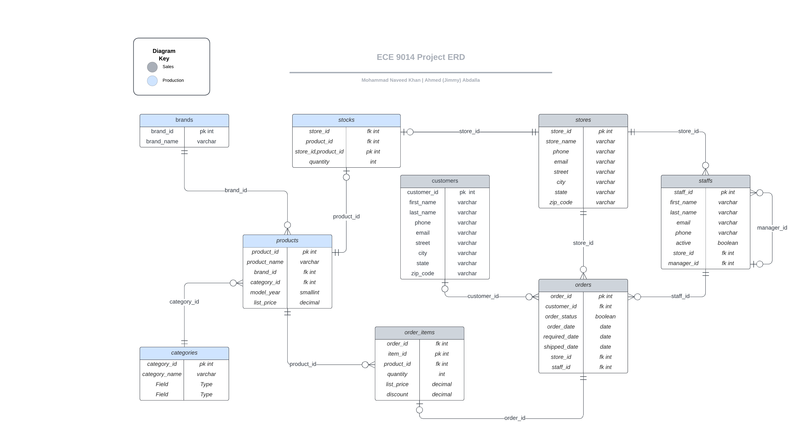

It looks like your project documentation could use some formatting improvements. Here's a cleaner version:

# ECE-9014 Project Report 1 - Implementation

By Mohammad Naveed Khan and Ahmed (Jimmy) Abdalla

## Entity-Relationship Diagram (ERD)



## Getting Started

To set up and use the project, follow these steps:

### 1. Clone the Repository

```shell
git clone https://github.com/naveedkhan1998/ECE-9014.git
```

### 2. Run Docker Compose

Start the Docker containers using the following command:

Make sure that all docker images are stopped prior to running this image. 

To view running docker images: run docker ps & docker stop [container name] 

```shell
docker-compose up
```

### 3. Access PgAdmin

Open a web browser and navigate to the following URL:

```
http://localhost:5555
```

Alternatively, if you have PgAdmin installed on your machine, you can use it instead.

### 4. Connect to the PgAdmin Server

Login using the following credentials:

- **Email:** Use "postgres@postgres.com".
- **Password:** Enter "postgres" as the password.

Click "Login" to establish a connection to the server.

### 5. Adding the Server

In PgAdmin, click on "Add New Server" or a similar option. Configure the connection settings as follows:

- **Host:** Enter "localhost" or "postgres"
- **Email:** Use "postgres@postgres.com".
- **Password:** Enter "postgres" as the password.
- **Port:** 5432

You are now ready to work on the project using PgAdmin.